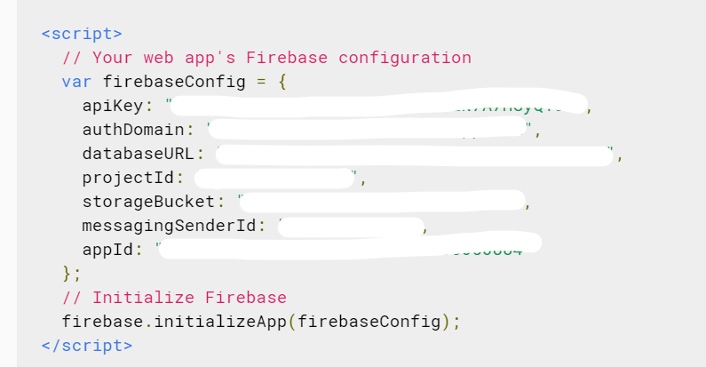

# Financês

An web app where you can control your financial life.

## Motivation

I was trying to have a better control over my finances and to do that I created a google sheet.

But why not create an app to do that instead?
So this is it :)

## Getting Started

1. Install the npm packages through `npm install`.
2. To connect the app to your firebase console, you need to add the enviroment variables above to your `.env` file.

```
REACT_APP_API_KEY=''
REACT_APP_AUTH_DOMAIN=''
REACT_APP_DATABASE_URL=''
REACT_APP_PROJECT_ID=''
REACT_APP_STORAGE_BUCKET=''
REACT_APP_MESSAGING_SENDER_ID=''
REACT_APP_APP_ID=''
```

_The image above shows where you can get your firebase values on your firebase console_



3. With that you're now Ok to run the development server with the command `npm run start`.

### Prerequisites

You should have an firebase app registered and know how to use google firestore.

- [Firebase Tutorial](https://firebase.google.com/docs/web/setup?authuser=0)

- [Firestore Tutorial](https://firebase.google.com/docs/firestore?authuser=0)

## Built With

- React and Redux
- Firebase Firestore and Authentication
- [Bulma Css Framework](http://bulma.io)

## License

MIT © [Samuel Monteiro](https://samuelmonteiro.netlify.com/)
